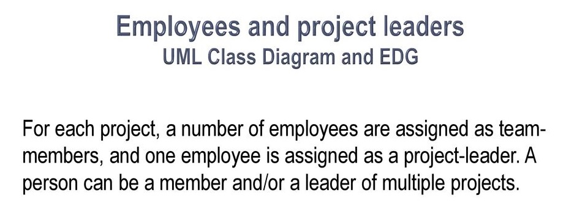
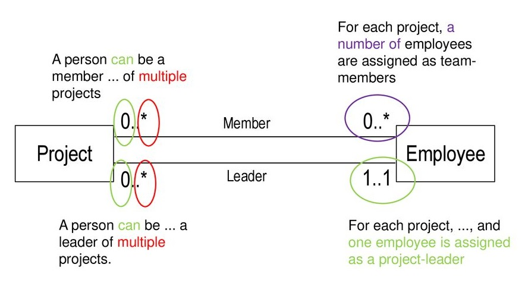
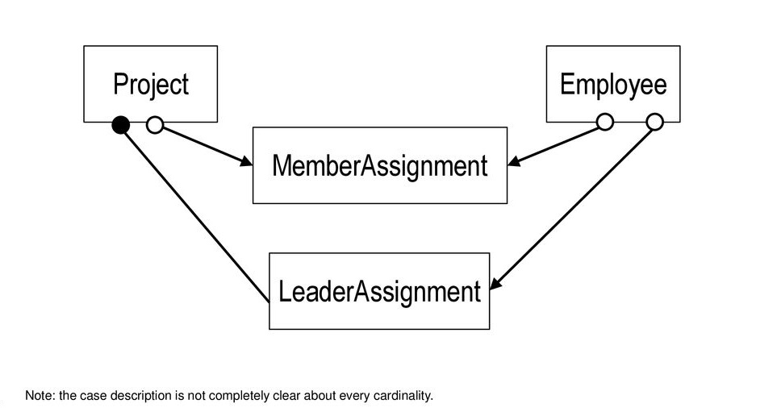

# DATA PROJECT MANAGEMENT SERVICE

This repository will handle all service (CRUD) request to Project Management database scheme.

### When creating new code repository for new microservice developer should :

1. Next you can start this task on seperate branch : `task/<dev_name>`
    - You can initiate new code on your working branch (seperate branch for each developer).
    - After finish the task then push all source code to this branch
2. Project must have unit test and minimum coverage is 80%.
3. Project should implement actuator for monitoring health of this service.
4. Project should implement clean code and no finding (critical & blocker) for code smelling.

### Scope Requirements

|Task|Detail|
|------------------|------------------|
|Epic||
|Class Diagram||
|Entity Relationship Diagram||

## Features

- can add/edit/delete/view for project data
- can add/edit/delete/view for employee data
- can assign project to employee
- can assign choose employee and assign as project lead

## Endpoint Naming Convention

- All endpoint should using method `POST`
- URL path should be in lowercase

Acceptable pattern for endpoint are below :

| Pattern  | Example |Description|
|-----------|-------------|-------------|
|/`${version_controller}`/`${object}`/`${operation}` | /v1/cat/create | save/create object cat |

Below are example endpoint convention standard for operation CRUD described by example object `cat`:

| Endpoint  | Operation |Result|
|-----------|-------------|-------------|
|/v1/cat/|get all cat |List of object cat|
|/v1/cat/create|insert cat  |Status of create object cat|
|/v1/cat/update|update cat |Status of update object cat|
|/v1/cat/delete|delete cat |Status of delete object cat|
|/v1/cat/detail|get detail cat| Detail of object cat|

## Important Rules For Developer

- Allowed to use `SNAPSHOT` version only for **development**
- Any addition of a new library must be clear where this source come from and put as a remark for the download URL
- Choose the latest / stable version if add a new library
- In this repository, attached `settings.xml` that should be use when running build/run/deploy application.
- parent pom should be using octomobile parent pom
   ```
   <project xmlns="http://maven.apache.org/POM/4.0.0\" xmlns:xsi=\"http://www.w3.org/2001/XMLSchema-instance\" xsi:schemaLocation=\"http://maven.apache.org/POM/4.0.0 http://maven.apache.org/maven-v4_0_0.xsd\">
 
    <!--The identifier of the parent POM-->
    <parent>
        <groupId>id.co.cimbniaga.octomobile</groupId>
        <artifactId>main-be-module-parent</artifactId>
        <version>1.2.0-RELEASE</version>
    </parent>
 
    <groupId>id.co.cimbniaga.octomobile<groupId>
    <modelVersion>4.0.0</modelVersion>
    <artifactId>test-be-data-project</artifactId>
    <name>Back End for Project Management Service</name>
 
    <dependencies>        
        .....
    </dependencies>
 
     ....
   </project>
   ```

## Project Structure Description

 ```
src
├── main
│   └── java
│   │  └── id.co.cimbniaga.octomobile.project
│   │      ├── component                                               # Package containing class that can be used as parent class for service class
│   │      ├── config                                                  # Package containing class with annotation @Config or any class for configuration 
│   │      ├── constant                                                # Package containing constant class
│   │      ├── controller                                              # Package containing controller class
│   │      ├── domain                                                  
│   │      │   ├── dao                                                 # Package containing dao/entity class class
│   │      │   └── dto
│   │      │       ├── common                                          # Package containing pojo / dto class that commonly used within this project (can be created if needed)
│   │      │       ├── external                                        # Package containing dto class that is used for messaging to/from surrounding & other microservices
│   │      │       └── internal                                        # Package containing dto class that is used for messaging to/from front end
│   │      ├── exception                                               # Package containing exception class & exception handler
│   │      ├── repository                                              # Package containing jpa interface & class
│   │      ├── service                                                 # Package containing class to handle business logic
│   │      └── util                                                    # Package containing custom utility & helper class with static method
│   └── resources
└── test
    └── java
    │  └── id.co.cimbniaga.octomobile.project
    │      ├── component                                               # Package containing unit test class for component class
    │      ├── controller                                              # Package containing integration test & unit test for controller class
    │      ├── domain                                                  # Package containing dto & pojo class for testing purpose
    │      ├── repository                                              # Package containing unit test class for jpa interface & class
    │      ├── service                                                 # Package containing unit test class for class that handle business logic
    │      └── util                                                    # Package containing unit test class for utility & helper class
    └── resources

```

## Requirements

For building and running the application you need:

- [JDK 11](https://www.oracle.com/java/technologies/javase-jdk11-downloads.html)
- [Maven 3](https://maven.apache.org)

## Running the application locally

There are several ways to run a Spring Boot application on your local machine. One way is to execute the `main` method
in the `id.co.cimbniaga.octomobile.Application` class from your IDE.

Alternatively you can use
the [Spring Boot Maven plugin](https://docs.spring.io/spring-boot/docs/current/reference/html/build-tool-plugins-maven-plugin.html)
like so:

```shell
mvn spring-boot:run
```

If you have any issue to download dependency libraries while running this application, you can run with command below:

```shell
mvn spring-boot:run --settings=settings.xml -Dmaven.wagon.http.ssl.insecure=true -Dmaven.wagon.http.ssl.allowall=true -Dmaven.wagon.http.ssl.ignore.validity.dates=true 
```

## Installing jar of application locally <a name="how-to-install"></a>

```shell
mvn clean install
```

If you have any issue to download dependency libraries while running this application, you can run with command below:

```shell
mvn clean install --settings=settings.xml -Dmaven.wagon.http.ssl.insecure=true -Dmaven.wagon.http.ssl.allowall=true -Dmaven.wagon.http.ssl.ignore.validity.dates=true 
```

## Check the code quality <a name="how-to-sonar"></a>

If you need to check the code quality of this project, you can run with command below:

```shell
mvn sonar:sonar
```

or

```shell
mvn sonar:sonar --settings=settings.xml -Dmaven.wagon.http.ssl.insecure=true -Dmaven.wagon.http.ssl.allowall=true -Dmaven.wagon.http.ssl.ignore.validity.dates=true 
```

**Notes** :

- Make sure the jar is already compiled & installed (by runing command mvn install) in local project folder
- Sonar will look up to the jar, test reports & compiled class in the build target folder

## References

- [Versioning in REST API](https://javahotfix.blogspot.com/2019/03/versioning-in-rest-api.html)
- [Octo Mobile Backend Parent POM](https://bitbucket.cimbniaga.co.id/projects/OMO/repos/main-be-module-parent/browse/readme.md)
- [Git Tutorials](https://www.atlassian.com/git/tutorials)
- [Spring Tutorials](https://spring.io/guides#tutorials)
